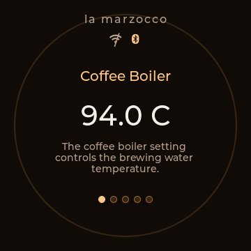
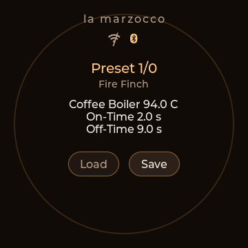
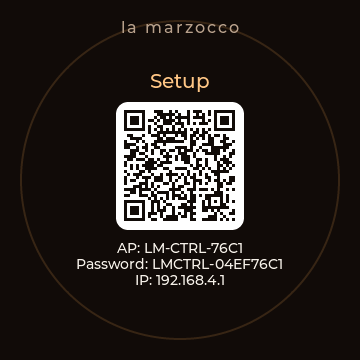
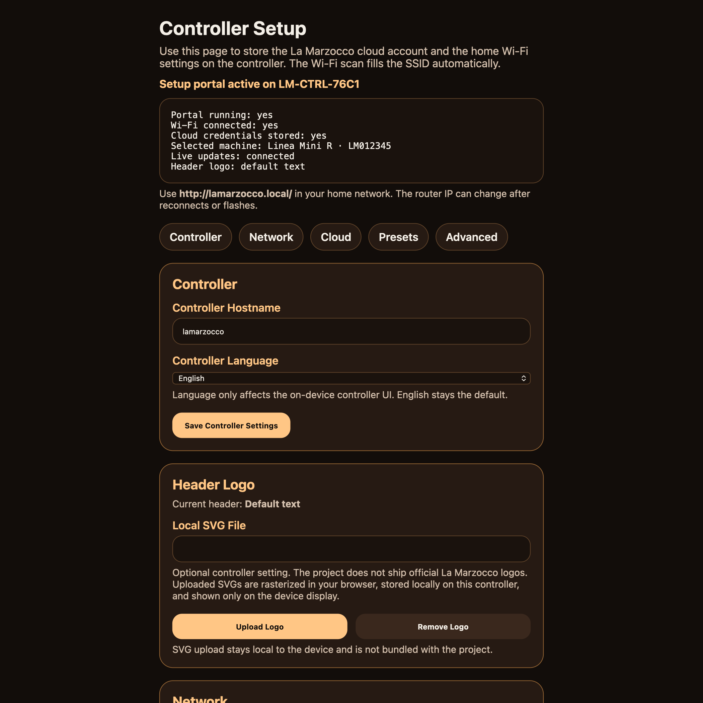

> [!IMPORTANT]
> This is a community project and is not affiliated with or endorsed by La Marzocco.

# La Marzocco Round Controller

This repository contains a standalone ESP32-S3 firmware project for a round external La Marzocco controller.

The aim is a dedicated hardware controller with BLE/cloud control, an on-device UI, and a local setup portal.

## Project status

The project is usable today, but it is still much closer to an actively developed community build than to a polished 1.0 release.

Today the strongest areas are:

- ESP32 controller bring-up on the targeted round hardware
- BLE control for the core day-to-day controller actions
- cloud-backed setup, machine selection, and prebrewing management

## Support development

If you want to help fund hardware testing, you can support the project here:
[PayPal.Me](https://paypal.me/kaspizzo)

The next bigger hardware-dependent step is proper Brew by Weight support.
For that, I need an Acaia Lunar with USB-C. My older Lunar with Mini-USB is unfortunately not supported by the implementation path I need for this controller.

## What is in this repo

- `firmware/esp32/`
  ESP-IDF firmware for a JC3636K718-style round ESP32-S3 controller board.
- `docs/controller/`
  Flashing, setup, bring-up, and implementation notes for the controller hardware.

## Current controller capabilities

The current ESP32 firmware supports:

- round on-device UI on the `360x360` display
- default text header (`la marzocco`) instead of a bundled vendor logo
- switchable on-device controller language (`English` default, optional `Deutsch`)
- physical outer ring input
- local haptic and LED-ring feedback
- local Wi-Fi/cloud setup portal with Wi-Fi scan
- optional local SVG upload for a custom controller header logo
- setup AP QR code and captive-portal style onboarding
- machine selection via La Marzocco cloud account
- BLE control for:
  - coffee boiler temperature
  - steam boiler `Off / 1 / 2 / 3` level control from the controller screen
  - standby
- cloud-backed prebrewing mode and timing changes
- periodic machine value refresh while the controller stays online
- recipe presets for:
  - coffee boiler temperature
  - prebrewing on-time
  - prebrewing off-time

The currently targeted hardware is a JC3636K718-style ESP32-S3 round controller board with:

- ST77916 display
- CST816S touch
- outer rotary ring
- WS2812 LED ring
- DRV2605L haptics

## Controller screenshots

Representative controller UI screenshots are published as PNG files under `docs/controller/images/`.
The full gallery is in [`docs/controller/SCREENSHOTS.md`](docs/controller/SCREENSHOTS.md).
The published defaults intentionally show the text header, not an official La Marzocco logo.

| Coffee Boiler | Presets | Setup |
| --- | --- | --- |
|  |  |  |

Local controller setup portal preview:

## Quick start

If you want to flash the controller:

1. Read the flashing guide in [`docs/controller/FLASHING_CONTROLLER.md`](docs/controller/FLASHING_CONTROLLER.md)
2. Read the setup flow in [`docs/controller/SETUP_GUIDE.md`](docs/controller/SETUP_GUIDE.md)
3. For firmware-specific notes, see [`firmware/esp32/README.md`](firmware/esp32/README.md)
4. For controller UI screenshots, see [`docs/controller/SCREENSHOTS.md`](docs/controller/SCREENSHOTS.md)

## Setup notes

- On first boot without stored Wi-Fi credentials, and again after a full factory reset, the controller opens `Setup` automatically and starts its own setup AP.
- In that state the setup screen shows a QR code for the controller AP plus the AP name, password, and local setup IP so onboarding can start directly on a phone.
- After home Wi-Fi is saved, the controller immediately tries to join that network. Once connected, the setup portal stays available again via the on-device setup gesture and the configured `http://<hostname>.local/` address.
- The cloud login path expects a direct La Marzocco account email/password. Accounts created only through Apple or Google sign-in are not expected to work with the current controller login flow.
- A possible workaround for Apple/Google-only accounts is to create a second La Marzocco account with a normal email/password login and grant that account access in the official app. Treat this as a best-effort workaround, not a guaranteed fix.
- Main gestures are: swipe down for `Presets`, swipe up for `Setup`, and long-press on the setup screen to open the on-device network reset flow.

## Developer tools

Desktop-side inspector tooling is maintained separately and is not part of this repository.

These tools are useful if you want to:

- inspect cloud dashboard responses on a desktop machine
- inspect settings, statistics, schedule, and dashboard websocket responses
- bootstrap machine selection and BLE token retrieval
- compare controller behaviour with a Python-side reference client
- debug BLE/cloud behaviour outside the embedded firmware loop
- build a normalized inventory of which fields are already mapped to the controller and which are still unused

They are developer-facing utilities, not part of the end-user firmware.

## License

Unless stated otherwise, the source code and project documentation in this repository are licensed under Apache-2.0. See [LICENSE](LICENSE) and [NOTICE](NOTICE).

The firmware in this repository builds and flashes without any vendor package or proprietary board bundle.
Official La Marzocco logos are not bundled in the repository or used as shipped controller defaults. Compatibility is described textually, and any custom logo upload is user-provided and stored locally on the controller.

## Known limitations

- The controller firmware currently targets one specific round ESP32-S3 hardware family.
- BLE and cloud behaviour still depends on La Marzocco's app, machine firmware, and backend behaviour.
- The current cloud onboarding flow depends on a direct La Marzocco email/password login and does not provide a dedicated path for Apple/Google-created accounts.
- The setup flow and firmware have been exercised on a real device, but the project should still be treated as community firmware rather than an appliance-grade release.
- The repository includes developer tooling that is useful for debugging but not intended as polished end-user UX.

## Why this fork exists

The upstream `pylamarzocco` project already solved a large part of the protocol and behaviour work around La Marzocco cloud and BLE interactions. This repository extends that foundation into a dedicated hardware controller:

- adding a standalone ESP32 controller firmware
- adding local setup and machine pairing flows
- adapting control paths to a real round hardware device

## Acknowledgements

This repository builds directly on community work that came before it.

- The main upstream software foundation is [`zweckj/pylamarzocco`](https://github.com/zweckj/pylamarzocco)
- Early reverse-engineering context from the public community thread by Plonx and others was important for the broader La Marzocco connectivity work
- The controller firmware bring-up also benefited from vendor documentation and demo code for the JC3636K718 hardware family

See [`ACKNOWLEDGEMENTS.md`](ACKNOWLEDGEMENTS.md) for the fuller attribution note and [`PUBLISHING.md`](PUBLISHING.md) for the release checklist.
