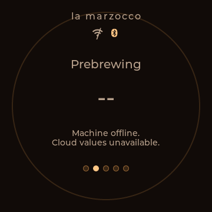
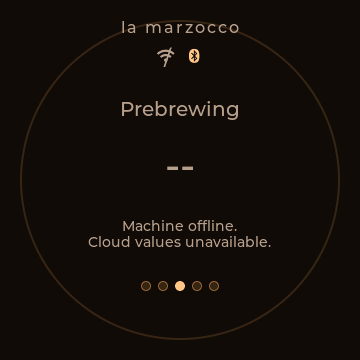
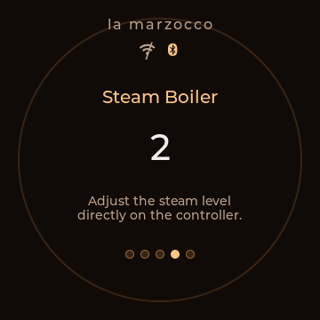
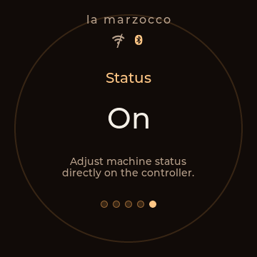
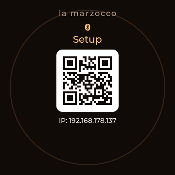

# Controller Screenshot Gallery

These screenshots are stored as PNG files in `docs/controller/images/` so they render reliably on GitHub and can be reused in issues, release notes, and documentation.
Regenerate the device shots and portal preview with `make -C tools/controller_screenshot_renderer export` after UI or portal changes.

The published screenshots intentionally show the shipped text header and not an official La Marzocco logo.

## Main control screens

| Coffee Boiler | Prebrewing On-Time | Prebrewing Off-Time |
| --- | --- | --- |
|  |  |  |

| Steam Boiler | Status | Preset View |
| --- | --- | --- |
|  |  |  |

## Setup screens

| First setup AP | Setup with Wi-Fi connected |
| --- | --- |
|  |  |

## Local setup portal

This screenshot is generated locally from `tools/controller_screenshot_renderer/controller_setup_portal_preview.html`, a preview page that mirrors the current setup portal structure and styling with representative example values. The preview tracks the current `Overview`, `Controller`, `Network`, `Cloud`, `Recipes`, `Advanced`, and `Diagnostics` layout while keeping the shipped presentation text-only.

## Notes

- UI screenshots for the round controller belong in `docs/controller/images/` because they are part of the controller-specific documentation.
- Released screenshots should keep vendor compatibility as text and avoid official logo branding in the published images.
- The current main-screen examples intentionally show BLE-authenticated fallback with a crossed Wi-Fi icon. A solid Wi-Fi icon is only shown once the selected machine is reachable through cloud.
- USB and battery icons are conditional runtime indicators, so they only appear in screenshots when the rendered sample state exposes them.
